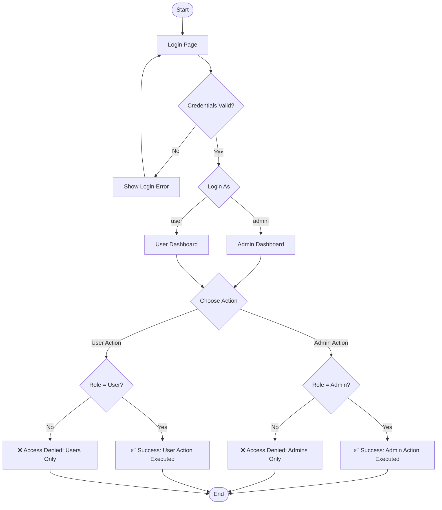

```mermaid
flowchart TD
    A([Start]) --> B[Login Page]
    B --> C{Credentials Valid?}
    C -- No --> D[Show Login Error]
    D --> B
    C -- Yes --> E{Login As}
    
    E -- admin --> F[Admin Dashboard]
    E -- user --> G[User Dashboard]
    
    F --> H{Choose Action}
    G --> H
    
    H -- Admin Action --> I{Role = Admin?}
    H -- User Action --> J{Role = User?}
    
    I -- Yes --> K[✅ Success: Admin Action Executed]
    I -- No --> L[❌ Access Denied: Admins Only]
    
    J -- Yes --> M[✅ Success: User Action Executed]
    J -- No --> N[❌ Access Denied: Users Only]
    
    K --> O([End])
    L --> O
    M --> O
    N --> O
```